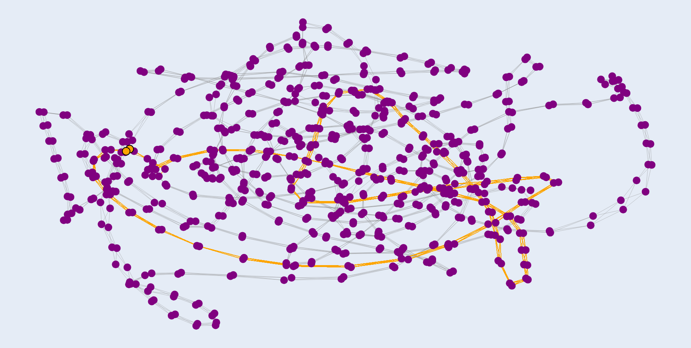

# Advent of Code 2023 🎁

Ho ho ho! 🎅🏻 
This repository contains my solutions to the Advent of Code 2023 puzzles.

## ☃️ Story

*"Something is wrong with global snow production, and you've been selected to take a look. The Elves have even given you a map; on it, they've used stars to mark the top fifty locations that are likely to be having problems.*
*You've been doing this long enough to know that to restore snow operations, you need to check all fifty stars by December 25th.*
*Collect stars by solving puzzles. [...]"* - ([Advent of Code](https://adventofcode.com/2023/day/1))

## Preview
#### Day 8: Graph Visualization

## 🦌 Links

    

